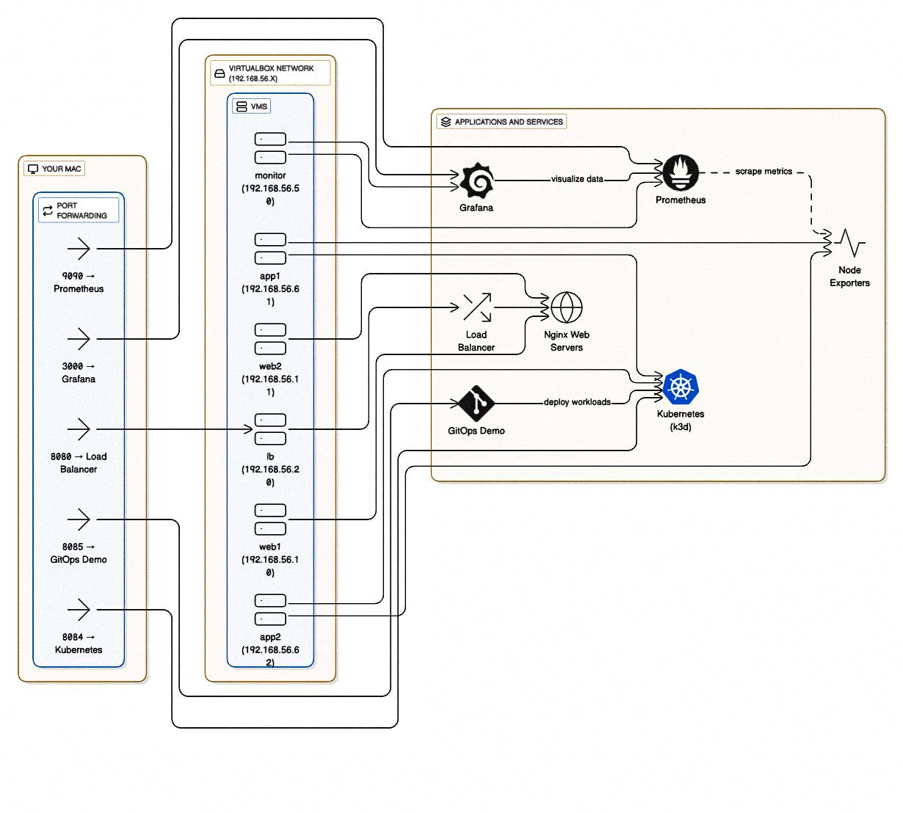
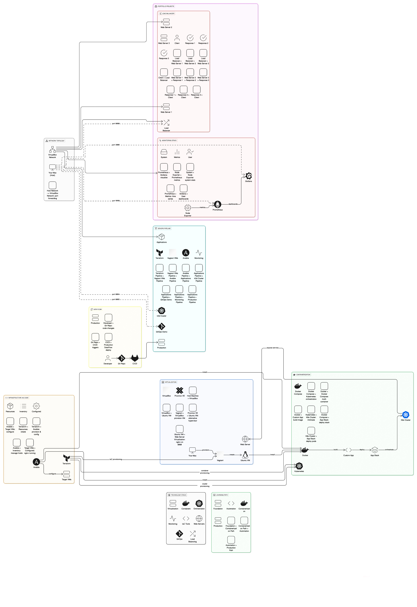

# Simplified DevOps Pipeline Architecture

## 📊 Visual Architecture Overview

### Complete DevOps Pipeline Architecture

*Comprehensive view of the entire DevOps pipeline from virtualization to production deployment*

### Simplified System Overview

*Streamlined view showing core components and data flow*

## 🏗️ Complete System Overview

```
┌─────────────────────────────────────────────────────────────────┐
│                    DEVOPS PIPELINE CURRICULUM                   │
│                      Simplified Architecture                    │
└─────────────────────────────────────────────────────────────────┘

┌─────────────────────────────────────────────────────────────────┐
│  YOUR MAC (HOST)                                                │
│  ┌─────────────────────────────────────────────────────────┐   │
│  │  Port Forwarding:                                       │   │
│  │  • 8080 → Load Balancer                                │   │
│  │  • 8084 → Kubernetes                                   │   │
│  │  • 8085 → GitOps Demo                                  │   │
│  │  • 9090 → Prometheus                                   │   │
│  │  • 3000 → Grafana                                      │   │
│  └─────────────────────────────────────────────────────────┘   │
└─────────────────────────────────────────────────────────────────┘
                                │
                                ▼
┌─────────────────────────────────────────────────────────────────┐
│  VIRTUALBOX NETWORK (192.168.56.x)                             │
│  ┌─────────────────────────────────────────────────────────┐   │
│  │  VMs:                                                   │   │
│  │  • web1 (192.168.56.10)                                │   │
│  │  • web2 (192.168.56.11)                                │   │
│  │  • lb (192.168.56.20)                                  │   │
│  │  • monitor (192.168.56.50)                             │   │
│  │  • app1 (192.168.56.61)                                │   │
│  │  • app2 (192.168.56.62)                                │   │
│  └─────────────────────────────────────────────────────────┘   │
└─────────────────────────────────────────────────────────────────┘
                                │
                                ▼
┌─────────────────────────────────────────────────────────────────┐
│  APPLICATIONS & SERVICES                                        │
│  ┌─────────────────────────────────────────────────────────┐   │
│  │  • nginx Web Servers                                    │   │
│  │  • Load Balancer                                        │   │
│  │  • Kubernetes Cluster (k3d)                             │   │
│  │  • Prometheus Monitoring                                │   │
│  │  • Grafana Dashboards                                   │   │
│  │  • Node Exporters                                       │   │
│  └─────────────────────────────────────────────────────────┘   │
└─────────────────────────────────────────────────────────────────┘
```

## 📚 Chapter Breakdown

```
┌─────────────────────────────────────────────────────────────────┐
│  CHAPTER 1: Virtualization                                      │
│  ┌─────────────────────────────────────────────────────────┐   │
│  │  VirtualBox + Vagrant → Ubuntu VM → nginx Server       │   │
│  └─────────────────────────────────────────────────────────┘   │
└─────────────────────────────────────────────────────────────────┘

┌─────────────────────────────────────────────────────────────────┐
│  CHAPTER 2: Containers                                          │
│  ┌─────────────────────────────────────────────────────────┐   │
│  │  Docker → Docker Compose → Kubernetes (Minikube)         │   │
│  └─────────────────────────────────────────────────────────┘   │
└─────────────────────────────────────────────────────────────────┘

┌─────────────────────────────────────────────────────────────────┐
│  CHAPTER 3: Infrastructure as Code                              │
│  ┌─────────────────────────────────────────────────────────┐   │
│  │  Terraform → Ansible → Configured Servers              │   │
│  └─────────────────────────────────────────────────────────┘   │
└─────────────────────────────────────────────────────────────────┘

┌─────────────────────────────────────────────────────────────────┐
│  CHAPTER 4: Portfolio Projects                                  │
│  ┌─────────────────────────────────────────────────────────┐   │
│  │  Load Balancing + Monitoring Stack                      │   │
│  └─────────────────────────────────────────────────────────┘   │
└─────────────────────────────────────────────────────────────────┘

┌─────────────────────────────────────────────────────────────────┐
│  CHAPTER 5: Complete Pipeline                                   │
│  ┌─────────────────────────────────────────────────────────┐   │
│  │  All Technologies Combined → Production-Ready Setup    │   │
│  └─────────────────────────────────────────────────────────┘   │
└─────────────────────────────────────────────────────────────────┘
```

## 🔄 Data Flow

```
Developer → Git → CI/CD → Production
    │         │      │         │
    ▼         ▼      ▼         ▼
Code Push → Repo → Deploy → Live Apps
```

## 🛠️ Technology Stack

```
┌─────────────────┐  ┌─────────────────┐  ┌─────────────────┐
│ Virtualization  │  │   Containers    │  │   Monitoring    │
│ • VirtualBox    │  │ • Docker        │  │ • Prometheus    │
│ • Vagrant       │  │ • Kubernetes    │  │ • Grafana       │
│ • Proxmox       │  │ • Docker Compose│  │ • Node Exporter │
└─────────────────┘  └─────────────────┘  └─────────────────┘

┌─────────────────┐  ┌─────────────────┐  ┌─────────────────┐
│ Infrastructure  │  │   Web Servers   │  │   Load Balance  │
│ • Terraform     │  │ • nginx         │  │ • nginx LB      │
│ • Ansible       │  │ • Alpine Linux  │  │ • Round Robin   │
│ • GitOps        │  │ • Port Forward  │  │ • Health Checks │
└─────────────────┘  └─────────────────┘  └─────────────────┘
```

## 🎯 Learning Path

```
Chapter 1 → Chapter 2 → Chapter 3 → Chapter 4 → Chapter 5
    │           │           │           │           │
    ▼           ▼           ▼           ▼           ▼
VMs &      Containers   Automation   Projects   Complete
Networking & K8s      & IaC        & Apps     Pipeline
```

## 🌐 Network Access

```
Your Browser → localhost:8080 → Load Balancer → Web Servers
Your Browser → localhost:9090 → Prometheus → Metrics
Your Browser → localhost:3000 → Grafana → Dashboards
Your Browser → localhost:8084 → Kubernetes → Apps
Your Browser → localhost:8085 → GitOps Demo → Auto Deploy
```

## 📊 What You Build

```
┌─────────────────────────────────────────────────────────────────┐
│  PRODUCTION-READY DEVOPS PIPELINE                              │
│  ┌─────────────────────────────────────────────────────────┐   │
│  │  ✅ High Availability (Load Balancing)                │   │
│  │  ✅ Container Orchestration (Kubernetes)              │   │
│  │  ✅ Infrastructure as Code (Terraform + Ansible)      │   │
│  │  ✅ Monitoring & Observability (Prometheus + Grafana) │   │
│  │  ✅ Automated Deployments (GitOps)                    │   │
│  │  ✅ Scalable Architecture                              │   │
│  └─────────────────────────────────────────────────────────┘   │
└─────────────────────────────────────────────────────────────────┘
```
